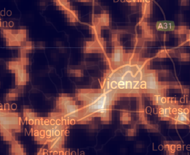
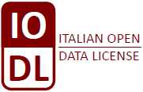

# Esploratore delle Luci Notturne

**Esplora la dinamica dell'inquinamento luminoso nel vicentino usando la [nostra web app](https://vicenzainnovationlab.users.earthengine.app/view/inquinamento-luminoso) basata su Google Earth Engine, una piattaforma big data, e immagini satellitari NASA.**

## Indice
1. [Finanziamento](#finanziamento)
2. [Introduzione](#introduzione)
3. [Struttura del repository](#struttura-del-repository)
4. [Come usare la web app](#come-usare-la-web-app)
5. [Come usare il codice sorgente](#come-usare-il-codice-sorgente)
6. [Contatti](#contatti)
7. [Ringraziamenti](#ringraziamenti)
8. [Licenza](#licenza)

## Finanziamento

Il progetto è parte del Programma Operativo Regionale del Fondo Europeo di Sviluppo Regionale (POR FESR 2014 - 2020) del Veneto, nell'ambito del bando dell'azione 231 volto alla "costituzione di Innovation Lab diretti al consolidamento/sviluppo del network Centri P3@-Palestre Digitali e alla diffusione della cultura degli Open Data."

## Introduzione

La luce che le nostre città emettono costantemente è dispersa nell'ambiente. Parte di questa luce, che viene emessa verso l'alto, viene registrata dai satelliti NOAA-20 e Suomi-NPP. Grazie a questi satelliti, abbiamo misurazioni medie mensili della quantità di luce in ogni punto della Terra, espressa in *nanowatt diviso per centimetro quadrato per steradiante*. Possiamo vedere come questi valori si cambiano negli ultimi anni. Ad esempio, il passaggio all'illuminazione esterna a risparmio energetico porta a una riduzione della perdita di luce, che è evidente anche dallo spazio. La costruzione di nuove aree residenziali e infrastrutture, al contrario, aumenta l'inquinamento luminoso.

Questo repository contiene il codice JavaScript che abbiamo utilizzato per l'elaborazione dei dati e per generare la web app. Consente di studiare le dinamiche della quantità della luce notturna (artificiale), dispersa nell'ambiente verso il cielo a partire dal 2014. I dati utilizzati per la ricostruzione di tali dinamiche sono le immagini notturne della Terra [VIIRS Stray Light Corrected Nighttime Day/Night Band Composites Version 1](https://developers.google.com/earth-engine/datasets/catalog/NOAA_VIIRS_DNB_MONTHLY_V1_VCMSLCFG) di pubblico dominio, ottenute e elaborate tramite Earth Engine.

## Struttura del repository

- `img/` - cartella con le immagini usate nel readme
- `code.js` - codice della web app
- `LICENSE.md` - file della licenza
- `README.md` - questo file

## Come usare la web app

SCREENSHOTS

## Come usare il codice sorgente

Il codice è stato sviluppato per essere eseguito all'interno della  piattaforma big data che si chiama [Google Earth Engine](https://earthengine.google.com/). In caso se vuoi esaminare gli algoritmi sottostanti o produrre una web app derivata è necessario avere un account gratuito Earth Engine. Se vuoi invece solo utilizzare la web app, basta [aprire il link](https://vicenzainnovationlab.users.earthengine.app/view/monitoraggio-aria).

Non appena hai l'account Earth Engine, esplora la sua interfaccia con [questo manuale](https://developers.google.com/earth-engine/guides/playground). Poi basta copiare il codice dal file `code.js` da questo repo a uno script Earth Engine per esiguirlo.

## Contatti

- Progetto nel sito del comune: [VicenzaInnovationLab](https://https://www.comune.vicenza.it/uffici/cms/innovationlabvicenza.php/)
- Sviluppatore: [Yaroslav Vasyunin](https://www.linkedin.com/in/vasyunin), Digital Innovation Hub di Confartigianato Vicenza ([digitalinnovationhubvicenza.it](https://digitalinnovationhubvicenza.it/))

## Ringraziamenti
Lo sviluppatore ringrazia *Vasily Lobanov*, Centro Earth Observation della RUDN University (Russia), per il prezioso sopporto nello sviluppo della interfaccia grafica della web app.

## Licenza

La IODL 2.0 (Italian Open Data License) prevede che l’utente possa liberamente:

- consultare, estrarre, scaricare, copiare, pubblicare, distribuire e trasmettere le informazioni;
- creare un lavoro derivato, per esempio attraverso la combinazione con altre informazioni (c.d. mashup), includendole in un prodotto o sviluppando un’applicazione informatica che le utilizzi come base dati.

In cambio, all’utente è chiesto solo d'indicare la fonte delle informazioni e il nome del soggetto che fornisce il dato, includendo, se possibile, un link alla licenza. Vedi il file [LICENSE.md](LICENSE.md) per dettagli.
